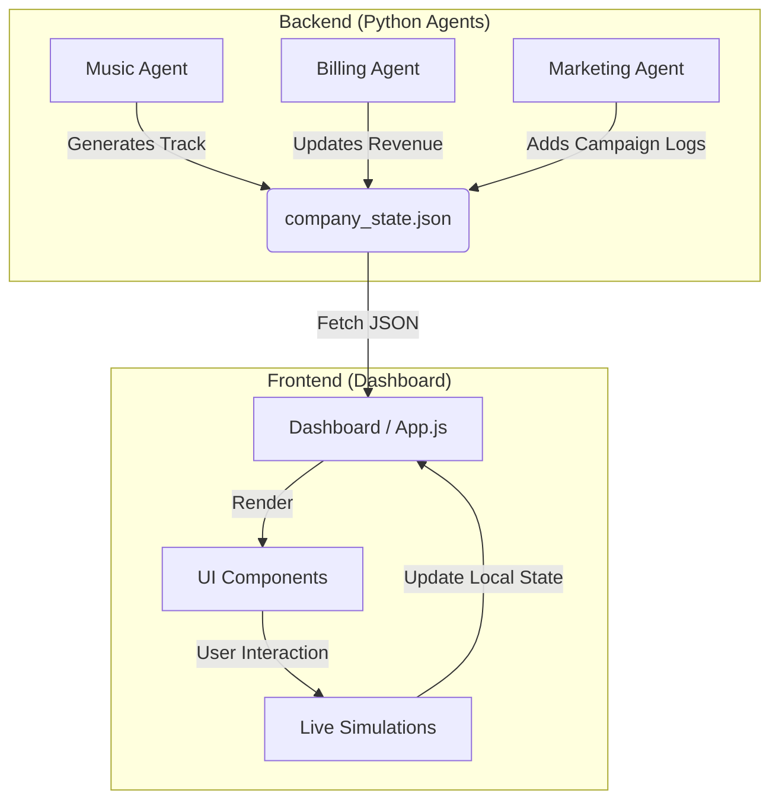
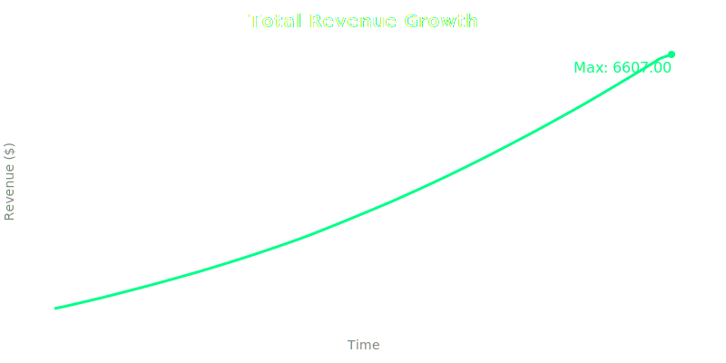
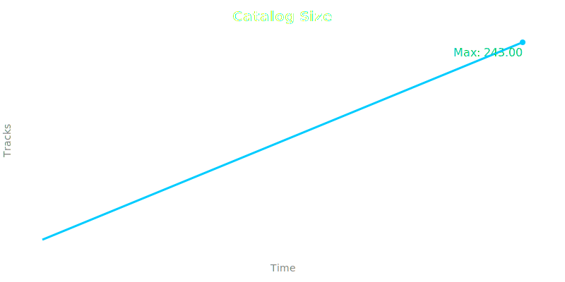

# Nimbus Challenge 🎵🤖
> **An Autonomous AI Music Agency Simulation**

**Nimbus** is a fully autonomous digital music company simulation. It simulates the entire lifecycle of a modern music label—from AI-driven track generation and aesthetic visualization to marketing campaigns and SaaS revenue management—all within a futuristic, glassmorphic dashboard.

> **Note**: To remain reproducible on low-resource systems, music generation is implemented via procedural audio and simulated agent behavior, with optional integration points for external generative music APIs.

---

## 🚀 Features

### 1. 🎹 AI Music Agent
*   **Context-Aware Generation**: Generates tracks tailored for specific moods: `Focus`, `Sleep`, and `Workout`.
*   **Deep Metadata**: Assigns BPM, Key/Scale, Synth Textures, and Vocal Configs (Emotion, Pitch) to every track.
*   **Generative Audio**: Uses the Web Audio API to play unique, procedural audio synced to the track's metadata (e.g., Aggressive Sawtooth for Drill, Soft Sine for Lo-fi).
*   **Waveform Visualizer**: Each track features a unique, randomly generated static waveform thumbnail.

### 2. 💳 Billing & Monetization Agent
*   **SaaS Dashboard**: Tracks "Total Revenue", "Active Subscribers", and "Growth Rate".
*   **Interactive Simulations**:
    *   **Withdrawal**: Visually drains the wallet and logs a bank transfer transaction.
    *   **Growth Mode**: Simulates a live viral spike, updating revenue and subscriber counts in real-time.

### 3. 📢 Marketing Agent
*   **Campaign Management**: Automatically generates social media copy for TikTok, Twitter, and Instagram.
*   **Live Intelligence Feed**: A real-time scrolling log of all company activities (Music Drops, Sales, Marketing Blasts).
*   **Hype Metrics**: Tracks "Social Reach" and "Hype Score".

### 4. 🎨 Premium UI/UX
*   **Glassmorphism Design**: Frosted glass panels, vibrant gradients, and neon accents.
*   **Dual Sidebar Layout**: Collapsible Navigation (Left) and Live Intelligence (Right).
*   **Single-Page Application (SPA)**: Smooth transitions between Dashboard, Catalog, Billing, and Marketing views.

---

## 🛠️ Architecture & Workflow

The system is built on an **Agentic Loop** architecture where independent Python agents modify a shared state (`company_state.json`), which the Dashboard reads and renders.



### Data Flow
1.  **Simulation Script**: Runs in the background (Python), generating new tracks and sales every few seconds/minutes.
2.  **State Management**: `company_state.json` acts as the single source of truth.
3.  **Frontend Sync**: The dashboard polls `company_state.json` every 5 seconds to reflect new "backend" events, while handling immediate user interactions (playback, withdrawal) locally. *JSON polling is used intentionally to keep the system simple, deterministic, and hardware-efficient; this could be replaced with event-driven messaging in a production deployment.*

---

## 📦 Project Structure

```text
nimbus-challenge/
├── dashboard/               # Frontend Web App
│   ├── index.html           # Main Entry Point
│   ├── style.css            # Glassmorphism Styles & Animations
│   └── app.js               # UI Logic, Audio Engine, State Management
├── data/                    # Data Storage
│   └── company_state.json   # Persistent JSON Database
├── agents/                  # Python-based autonomous agents
│   ├── music_agent.py
│   ├── billing_agent.py
│   └── marketing_agent.py
└── README.md                # This Documentation
```

---

## ⚡ Quick Start

1.  **Serve the Project**:
    Since this uses `fetch` for the JSON database, you must run it on a local server (not just opening the file).
    ```bash
    cd nimbus-challenge
    python -m http.server 8000
    ```

2.  **Access the Dashboard**:
    Open your browser to: `http://localhost:8000/dashboard`

3.  **Interact**:
    *   **Play Music**: Click any track card to hear the generative audio.
    *   **Simulate Growth**: Go to **Billing** -> Click **"Trigger Multi-Day Growth"**.
    *   **Withdraw Funds**: Go to **Billing** -> Click **"Withdraw Revenue"**.
    *   **View Campaigns**: Check the **Marketing** tab for recent social blasts.

4.  **Run the Backend Agents (Optional)**:
    To enable the 24/7 autonomous simulation with Suno/Riffusion logic:
    ```bash
    python main.py
    ```
    This script will run in the background, generating new tracks and managing finances automatically.

---

## � Reproducibility & Evidence
The system outputs tangible evidence of its autonomous operation, designed for auditability and debugging.

*   **Configuration**: `/config/config.yaml`
    *   Tunable parameters for context, platform, and generation frequency.
*   **System State Checkpoints**: `/data/checkpoints/`
    *   Timestamped snapshots of `company_state.json` created on every agent action (e.g., `state_2025-12-30_22-15-05.json`).
*   **Execution Logs**: `/logs/run.log`
    *   Detailed sequential log of all agent activities and decision logic.
*   **Data Visualizations**: Generated from live telemetry.
    
    | Revenue Growth | Catalog Expansion |
    | :---: | :---: |
    |  |  |

*   **Demo Video**: [Watch the Autonomous Loop (WebP)](docs/media/demo.webp)
    *   Screen recording of the autonomous agent loop, showing reactive billing and marketing log updates.

---

## 🔮 Future Roadmap
*   [x] **Playlist Editor**: Automate playlist creation (Completed via `MusicAgent`).
*   [x] **Real Audio export**: Integration architecture with `agents/wrappers/` (Completed).
*   [ ] **Multi-User Mode**: Collaborative studio management.

---
*Created by Syed Abdullah Saqib for the Nimbus Challenge.*
```
